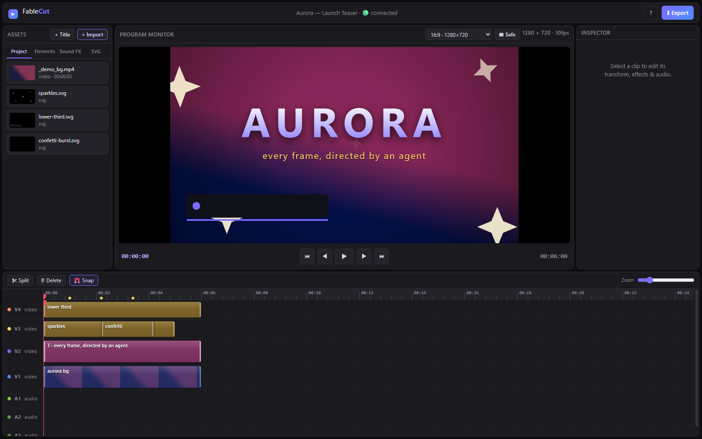

# FableCut

**A browser video editor that AI agents can drive.**

<a href="https://trendshift.io/repositories/77702?utm_source=trendshift-badge&amp;utm_medium=badge&amp;utm_campaign=badge-trendshift-77702" target="_blank" rel="noopener noreferrer"></a>

[](https://news.ycombinator.com/item?id=48845422)
[](https://dev.to/devteam/top-7-featured-dev-posts-of-the-week-815)
[](https://registry.modelcontextprotocol.io/v0/servers?search=fablecut)
[](https://github.com/punkpeye/awesome-mcp-servers)
[](https://glama.ai/mcp/servers/ronak-create/FableCut)

<https://github.com/user-attachments/assets/2430b854-168b-4a9a-af2e-489e5efa7543>

FableCut is a Premiere-style non-linear video editor that runs entirely in your
browser — and exposes its whole timeline as one JSON document. Edit it by hand,
from the UI, or let an AI agent (Claude Code, Claude Desktop, or anything that
speaks MCP/REST) cut your video for you while you watch the timeline update
live.

Zero npm dependencies. One `node server.js`. That's it.



## Why it's interesting

Most "AI video" tools hide the edit behind an API. FableCut flips that: the
**project file is the interface**. `project.json` describes media, clips,
tracks, effects, keyframes and transitions — any process that can write JSON
can edit video, and the open browser UI hot-reloads within ~150 ms via
server-sent events. A human and an agent can work on the same timeline at the
same time.

## Features

**Editing**

- 3 video tracks + 4 audio tracks, drag/trim/split/snap, undo/redo
- **Direct manipulation on the monitor** — click a clip or title on the preview to
  move, resize (corner handles), or rotate (top handle, Shift-snap) it directly
- **Timeline multi-select** — rubber-band marquee (drag on empty track area),
  <kbd>Ctrl/Cmd/Shift+click</kbd> to add/remove clips, <kbd>Ctrl+A</kbd> to
  select all, <kbd>Esc</kbd> to deselect. Drag any selected clip to move the
  whole group; <kbd>Delete</kbd> removes all selected; <kbd>S</kbd> splits all
  selected at the playhead. Inspector shows an "N clips selected" banner.
- Beat & cue markers (tap <kbd>⇧m</kbd> on the beat during playback) with edge snapping
- Press <kbd>Alt+t</kbd> to add an in/out transition based on the playhead position over the selected clip. The last used transition is remembered as the default. Drag the overlay triangle to adjust duration; <kbd>Delete</kbd> clears the focused transition.
- Real decoded audio waveforms on clips
- Canvas aspect presets (16:9, 9:16 reels, 4:5, 1:1) + safe-area guides
- Resizable workspace: drag the divider between monitor and timeline (double-click resets), plus S/M/L timeline track-density presets (S hides thumbnails for compact tracks)
- **Zoom to selection** (<kbd>⇧Z</kbd>) frames all selected clips, not just one
- **IN/OUT work area** — set markers with <kbd>i</kbd> and <kbd>o</kbd> (<kbd>⇧I</kbd> / <kbd>⇧O</kbd> to clear). Enabling **Limit** constrains playback to the marked range and maps <kbd>Home</kbd> / <kbd>End</kbd> to the IN and OUT positions rather than the full timeline. <kbd>t</kbd> splits clips at the markers; <kbd>⇧t</kbd> trims clips to the work (between marker in and marker out) area.
- **Find & close gaps** — a gap is a stretch where every enabled track is empty (black frames). <kbd>g</kbd> jumps the playhead to the next shared gap (wraps; respects IN/OUT when both are set). <kbd>⇧G</kbd> closes the gap under the playhead by pulling later clips left on all enabled tracks.
- **Reset a property** — <kbd>Ctrl/Cmd+click</kbd> an inspector **label** to restore that effect/prop to its default (paired fields like Crop L/R reset together). Matching keyframes for the prop are cleared too; transition labels clear the in/out transition.

**Look**

- 14 one-click filter presets (cinematic, teal-orange, noir, vintage, cyberpunk, sunset, midnight…)
- **Adjustment layers** — one clip grades everything below it, Premiere-style
- Full grade controls: brightness/contrast/saturation/hue, **temperature & tint**,
  blur, grayscale/sepia/invert, **vignette**, animated **film grain**
- Blend modes (screen, multiply, overlay…), fit modes (contain/cover/stretch),
  per-edge cropping, corner radius, flip H/V
- **Chroma key** (green screen) with tolerance/softness + spill suppression
- **AI background removal** (person cut-out, in-browser via MediaPipe)

**Motion**

- Keyframe animation on ~25 properties with easing
- **Speed ramps** — keyframe `speed` and the engine time-remaps video *and* the
  export audio mix (the fast-into-slow-mo reel move)
- **Camera shake** and **RGB-split/chromatic aberration**, both animatable
- 17 transitions: fades, slides, wipes (4 directions), zoom, iris, spin, blur,
  whip-pan, **glitch**, **pop**

**Text**

- **Title styles** — one-tap cohesive looks (Impact, Elegant, Kinetic cut, Neon,
  Handwritten, Luxury, and more); new titles vary the font, placement and animation
  automatically instead of defaulting to one flat style
- Kinetic captions: typewriter, word-pop, word-slide, karaoke, **letter-pop**,
  **wave**, **bounce**, **shake**, **clip-reveal**, **zoom-in**, **font-cut**
  (rhythmic typeface cuts), **rise-mask**
- **Neon glow** for that TikTok caption look
- Font editor: system fonts, drop-in custom fonts (`library/fonts/`), and **any
  Google Font by name** — loaded automatically
- Gradient fills, outline, background pills, letter-spacing, line-height,
  weights, italic, uppercase, soft shadows
- **Text layout** — horizontal Align: left / center / right / **justify**
  (extra spaces between words). Drag a title’s corner handles to create a
  **text box** (`boxW` / `boxH`); further corner drags resize it (opposite
  corner stays fixed; <kbd>Ctrl/Cmd</kbd> resizes from center; <kbd>Shift</kbd>
  locks aspect). Inside a box, text wraps at the fixed font size by default;
  enable **Scale to fit** to shrink the font so the whole block fits. **V-align**
  (top / middle / bottom) places the text block vertically in the box. Set Box
  W/H to `0` to return to hug-content sizing.

**Animated SVG clips**

- A first-class `svg` clip kind: CSS-`@keyframes`-animated SVGs render
  **frame-accurately** in preview and export (the compositor freezes the
  animation at any time). Agents can author their own vector overlays —
  lower-thirds, confetti, sparkles — as plain `.svg` files. Starters included.

**Remake a reference video**

- Give it a reference edit (a reel you like) and get back an **edit blueprint**:
  shot boundaries, music beats + BPM, a loudness curve, per-shot energy, the
  drop — plus the reference's **music track extracted** into your media, ready
  to rebuild the same idea with your own footage. Zero extra dependencies
  (ffmpeg does the decoding; onset/tempo detection is plain Node).
  `node analyze.js ref.mp4`, `POST /api/analyze`, or the
  `fablecut_analyze_reference` MCP tool.

**Asset library**

- `library/` folders surface as tabs in the UI: **Elements** (overlay art),
  **Sound FX**, **SVG** — drop files in, the open editor refreshes live

**Export**

- Fast export: browser renders every frame + an offline audio mix, ffmpeg
  encodes a frame-accurate CRF-18 MP4 (keeps rendering if you switch tabs)
- Realtime MediaRecorder fallback when ffmpeg isn't available

## Quick start

```bash
git clone https://github.com/ronak-create/FableCut.git
cd FableCut
node server.js        # → http://localhost:7777
```

Requirements: **Node 18+** and a Chromium-based browser. **ffmpeg on PATH** is
optional but recommended (fast export + upload remuxing). AI background
removal fetches its model from a CDN on first use.

The server binds **127.0.0.1 only** (v1.3.1+). To use it from another device on
your LAN, opt in explicitly: `HOST=0.0.0.0 FABLECUT_ALLOWED_HOSTS=<your-ip> node server.js`.

Drop media into the window (or `./media/`), drag clips onto the timeline, edit,
export.

## Driving it with an AI agent

Everything an agent needs is in **[CLAUDE.md](CLAUDE.md)** — the complete
schema, semantics and recipes. Point any capable model at that file and it can
operate the editor end to end.

Three equivalent control surfaces:

1. **MCP** (best for Claude Code / Claude Desktop) — register the bundled
   zero-dependency MCP server once:

   ```bash
   claude mcp add -s user fablecut -- node "<path-to>/fablecut/mcp-server.js"
   ```

   Tools: `fablecut_status` (auto-starts the editor), `fablecut_docs`,
   `fablecut_get_project`, `fablecut_set_project`, `fablecut_patch_project`,
   `fablecut_import_media`, `fablecut_analyze_reference`.

   FableCut is also published on the **official MCP registry** as
   [`io.github.ronak-create/fablecut`](https://registry.modelcontextprotocol.io/v0/servers?search=fablecut)
   — each release ships an MCPB bundle (`fablecut.mcpb`) that MCPB-capable
   clients can install directly.

   The surface is **token-efficient by design**: agents patch the timeline with
   small ops (`fablecut_patch_project`) instead of round-tripping the whole
   document, read a compact one-line-per-clip summary
   (`fablecut_get_project {compact:true}`), and fetch only the manual sections
   they need (`fablecut_docs {section:"props"}`).
2. **The file** — read `project.json`, modify, bump `revision`, write. The UI
   live-reloads.
3. **REST** — `GET/PUT /api/project`, `POST /api/upload`, `GET /api/library`,
   SSE at `/api/events`. See CLAUDE.md for the full list.

Example: ask Claude Code *"cut these six clips to the beat markers, add a
teal-orange grade, put a word-pop caption on top and a whoosh on every cut"* —
and watch the timeline rebuild itself.

Or hand it a reference: *"here's a reel I like — analyze it and remake it with
my clips, same music"*. The agent calls `fablecut_analyze_reference`, gets the
blueprint (cuts, beats, BPM, energy, drop, extracted music), and rebuilds the
structure shot-for-shot with your footage.

**Conflict-safe concurrent editing**: the UI, the MCP tools, and direct
`project.json` writes all agree on a `revision` counter. If you edit a clip in
the UI while an agent is mid-task, the agent's next write is rejected (409 from
the REST API / a conflict error from `fablecut_set_project`) instead of
silently overwriting your change. The UI similarly detects when an agent write
supersedes a not-yet-saved local tweak and tells you with a toast instead of
dropping it silently.

## Project layout

```
server.js        zero-dependency HTTP server: static hosting, REST API, SSE,
                 ffmpeg export pipeline
app.js           the editor: timeline UI, compositor, keyframes, text engine,
                 SVG rasterizer, chroma key, exporters
index.html       single-page UI
style.css        dark editor theme
mcp-server.js    stdio MCP server exposing the editor to AI agents
analyze.js       reference-video analyzer: shots, beats/BPM, energy, drop,
                 music extraction (module + CLI)
CLAUDE.md        the agent manual (schema + recipes) — also served by fablecut_docs
project.json     your timeline (created on first run; gitignored)
media/           project footage (gitignored)
analysis/        cached edit blueprints from /api/analyze (gitignored)
library/         default assets: elements/ sfx/ svg/ fonts/
exports/         finished renders (gitignored)
```

## Authoring animated SVG overlays

SVGs animate with plain CSS `@keyframes`. One convention: never hardcode
`animation-delay` — set `--d: 0.4s` instead, and the compositor drives time by
pausing all animations and rebasing their delays. Full rules + a skeleton in
[CLAUDE.md](CLAUDE.md#authoring-animated-svgs-the-svg-clip-kind); working
examples in [`library/svg/`](library/svg/).

## Notes

- The repo ships with **20 Google Fonts** (`library/fonts/`, OFL — see
  `LICENSES.md` there) and a set of self-authored SVG overlays and animated
  elements (`library/elements/`, `library/svg/`, MIT like the rest of the repo).
- `library/sfx/` is yours to fill (gitignored): sound-effect sites typically
  don't allow redistributing their files in a public repo, so FableCut doesn't —
  `library/sfx/README.md` lists good free sources.
- Export runs in the browser because the compositor *is* the browser; agents
  ask you to click Export (or render directly with ffmpeg from `media/`).

## License

[MIT](LICENSE)
