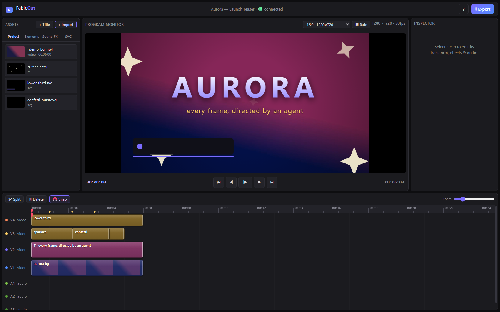

<div align="center">


**A browser video editor that AI agents can drive.**

<a href="https://trendshift.io/repositories/77702?utm_source=trendshift-badge&amp;utm_medium=badge&amp;utm_campaign=badge-trendshift-77702" target="_blank" rel="noopener noreferrer"></a>

[](https://news.ycombinator.com/item?id=48845422)
[](https://dev.to/devteam/top-7-featured-dev-posts-of-the-week-815)
[](https://registry.modelcontextprotocol.io/v0/servers?search=fablecut)
[](https://github.com/punkpeye/awesome-mcp-servers)
[](https://glama.ai/mcp/servers/ronak-create/FableCut)
[](https://glama.ai/mcp/best/browser-automation)
[](https://fablecut.space/docs/)
[](https://discord.gg/EFMQH7d6Tv)

**English** · [简体中文](docs/i18n/README.zh-CN.md) · [日本語](docs/i18n/README.ja.md) · [Español](docs/i18n/README.es.md) · [Português (BR)](docs/i18n/README.pt-BR.md)

</div>

<https://github.com/user-attachments/assets/2430b854-168b-4a9a-af2e-489e5efa7543>

FableCut is a Premiere-style non-linear video editor that runs entirely in your
browser — and exposes its whole timeline as one JSON document. Edit it by hand,
from the UI, or let an AI agent (Claude Code, Claude Desktop, or anything that
speaks MCP/REST) cut your video for you while you watch the timeline update
live.

Zero npm dependencies. One `node server.js`. That's it.



## Why it's interesting

Most "AI video" tools hide the edit behind an API. FableCut flips that: the
**project file is the interface**. `project.json` describes media, clips,
tracks, effects, keyframes and transitions — any process that can write JSON
can edit video, and the open browser UI hot-reloads within ~150 ms via
server-sent events. A human and an agent can work on the same timeline at the
same time.

## Features

**Editing**

- Video + audio tracks (default 3+4; add more with **+V** / **+A** in the track
  header; right-click an empty header → **Remove track**), drag/trim/split/snap,
  undo/redo
- **Settings** (cog in the top bar) — optional prefs stored in this browser via
  `localStorage`. Enable **Link timeline and Project bin selection** so picking a
  timeline clip highlights its media in Project, and clicking a Project item
  selects every timeline clip that uses it (off by default).
- Video + audio tracks (default 3+4), drag/trim/split/snap, undo/redo
  - **+V** / **+A** in the track header add a video or audio lane (up to 16 each)
  - Right-click an empty track header → **Remove track** (disabled if the lane
    has clips, or if it would leave you with zero video/audio tracks)
  - Track header **S** solos that lane (mutes all others); click again to restore
    the previous mute state. Using the mute toggle while soloed exits solo.
  - **Track targeting** — click a track's name to target / untarget it (lit =
    targeted). Split, insert, ripple, close gap and jump-to-cut touch targeted
    tracks only; the eye / speaker toggle is output-only (hide from preview and
    export) and no longer blocks edits. A selected clip is edited wherever it sits.
  - **Track lock** — the padlock in the track header. Nothing on a locked track
    can be moved, trimmed, split or deleted, and ripples leave it in place while
    the other tracks shift — lock the music bed and re-cut the picture freely.
- **Clip lock, disable and unlink** — right-click a clip (or use the toggles at
  the top of the inspector): **Lock** pins it like a locked track; **Disable**
  (<kbd>⇧E</kbd>) keeps it on the timeline but hides it from preview and export;
  **Unlink** (<kbd>Ctrl/Cmd+L</kbd>) splits a video from its audio so they move
  separately, and **Link** re-joins them once they line up again. Agents see
  locks too: `fablecut_patch_project` refuses to edit locked clips unless the
  op says `force: true`.
  - Dropping a video with more audio channels than A-tracks **adds the missing
    lanes automatically** (up to 16) and toasts how many were added; each channel
    becomes a linked stem on its own A-track
- **Direct manipulation on the monitor** — click a clip or title on the preview to
  move, resize (corner handles), or rotate (top handle, Shift-snap) it directly
- **Timeline multi-select** — rubber-band marquee (drag on empty track area),
  <kbd>Ctrl/Cmd/Shift+click</kbd> to add/remove clips, <kbd>Ctrl+A</kbd> to
  select all, <kbd>Esc</kbd> to deselect. Drag any selected clip to move the
  whole group; <kbd>Delete</kbd> removes all selected; <kbd>S</kbd> splits all
  selected at the playhead. Inspector shows an "N clips selected" banner.
- Beat & cue markers (tap <kbd>m</kbd> on the beat during playback) — name and colour them, drag them on the ruler, jump with <kbd>⇧m</kbd> / <kbd>Alt+⇧m</kbd> or the **Markers** list; snapping targets (clip edges, playhead, markers, IN/OUT, keyframes, frame grid) are picked from the **▾** beside Snap
- Press <kbd>Alt+t</kbd> to add an in/out transition based on the playhead position over the selected clip. The last used transition is remembered as the default. Drag the overlay triangle to adjust duration; <kbd>Delete</kbd> clears the focused transition.
- Real decoded audio waveforms on clips
- **Mixer** — the **Mixer** tab beside the Inspector has a strip per audio
  track (fader, pan, mute, solo, meter) and a master fader with a live LUFS
  readout. Preview and export run through the same mix, so what you hear is
  what renders.
- **Clip gain, channels and Normalize** — each audio clip has a **Gain** (dB,
  before volume and keyframes), a **Channels** mode (stereo, mono, left,
  right, swap) and **Normalize**: measure the selected clips (ITU-R BS.1770
  loudness or sample peak) and set their gain to hit −14 / −16 / −23 LUFS or
  −1 dBFS. Linked stems share one gain so a stereo pair stays balanced.
- **Volume line, fades and crossfades** — every audio clip shows its volume as
  a line you drag; Ctrl/Cmd-click adds a keyframe, Alt-click removes one. Corner
  grips drag fades in and out, drawn with their real curve (constant power,
  constant gain or exponential). **Shift+D** crossfades the cut next to the
  selection, borrowing spare media from both sides so nothing else moves.
- **Auto-duck** — select the music, pick the dialogue track and an amount, and
  the music dips wherever someone speaks (ramping down just before, back up
  after). It rides on top of the music's own volume, so re-running or clearing
  it never touches your levels. Agents use `fablecut_auto_duck`.
- **Audio effects and presets** — EQ, high/low-pass, compressor, limiter,
  noise gate, delay, reverb, distortion, stereo width and pitch shift, chained
  per clip, per track (Mixer → **FX**), per bus and on the master. Presets:
  Clean voice, Podcast, Radio, Deep voice, Telephone, Cinematic, Wide and
  Muffled, all tweakable afterwards. Preview and export run the same effects.
  Agents use the `setFx` patch op.
- **Effect automation** — the ◆ beside an effect setting keys it at the
  playhead, like clip keyframes: sweep a filter into the drop, open up a
  reverb at the end. Agents use `setFxKeys`.
- **Submix buses** — **+ Bus** in the Mixer adds a bus with its own effects,
  fader, pan, mute and meter; route tracks into it from the menu under each
  track's name (all the dialogue through one compressor and one fader).
- **Noise reduction** — the inspector's **Noise** control (Light / Medium /
  Strong) measures the file's noise floor and renders a cleaned copy with
  ffmpeg; the clip's audio switches to it and **Off** switches back. Agents
  use `fablecut_denoise`.
- **Project bin folders** — tree view with expand/collapse; drag media or folders to nest; right-click the **Project** tab → New folder; drop files onto a folder to import into it
- **Import from URL** — **+ URL** downloads an HTTPS video/audio/image into
  `./media/` (same-origin after import). Remote SVG is refused. Agents use
  `fablecut_import_media` with an `https://` path. The URL is not kept as
  `media.src` — that would taint the canvas and break export.
- **Audio Hold** — timeline toolbar toggle: while paused, loops **one frame** of
  audio at the playhead (useful when stepping frame-by-frame). Scrubbing or
  frame-step retargets the held slice; meters stay live. **Play** / **Pause**
  turns it off.
- Canvas aspect presets (16:9, 9:16 reels, 4:5, 1:1) + project FPS select
  (24 / 25 / 30 / 50 / 60; non-preset rates show as Custom) + safe-area guides
- **Export frame / reframing** — composition canvas can be larger than the delivery
  crop (`exportFrame` in `project.json`). Preview dims the overscan; drag the
  **Export frame** handle to reframe (e.g. 16:9 canvas → 9:16 export). Fast export
  crops to the frame; WebCodecs and Realtime export are disabled while a frame is set
- **Program Monitor zoom** — mouse-wheel over the preview zooms the composition
  toward the cursor (fit → up to **2 screen pixels per canvas pixel**). Magnified
  view uses **native scrollbars** so overflow stays reachable; middle-click or
  <kbd>Alt</kbd>+drag pans. The **Fit** button (shown while zoomed) resets to the
  fit-to-stage baseline
- Full **J**/**K**/**L** shuttle — <kbd>L</kbd> plays forward, <kbd>J</kbd> in reverse; tap
  again for 1.5×/2×/4×, the other key turns around, <kbd>K</kbd> stops. Hold <kbd>K</kbd> and
  tap <kbd>J</kbd>/<kbd>L</kbd> to step a frame, or hold both to crawl at ¼ speed. Preview
  only, never the export
- Typed timecode — click the playhead readout (or type digits) to jump: `01:15:00`,
  `1500`, `+30`, `12.5`; the IN / OUT readouts take typed times too
- Resizable workspace: drag the divider between monitor and timeline (double-click resets), plus S/M/L timeline track-density presets (S hides thumbnails for compact tracks)
- **Zoom to selection** (<kbd>⇧Z</kbd>) frames all selected clips, not just one
- **IN/OUT work area** — set markers with <kbd>i</kbd> and <kbd>o</kbd> (<kbd>⇧I</kbd> / <kbd>⇧O</kbd> to clear). The Program Monitor shows playhead as `current / sequence duration`; when markers are set, IN, marked duration, and OUT stack on the right. **Export** has a Range dropdown (Entire timeline / IN–OUT; defaults to IN–OUT when markers exist) so you can keep markers for split/trim and still export the full sequence. Enabling **Limit** constrains playback to the marked range and maps <kbd>Home</kbd> / <kbd>End</kbd> to the IN and OUT positions rather than the full timeline. <kbd>t</kbd> splits clips at the markers; <kbd>⇧t</kbd> trims clips to the work (between marker in and marker out) area.
- **Find & close gaps** — a gap is a stretch where every targeted track is empty (black frames). <kbd>g</kbd> jumps the playhead to the next shared gap (wraps; respects IN/OUT when both are set). <kbd>⇧G</kbd> closes the gap under the playhead by pulling later clips left on all targeted tracks (locked clips stay put).
- **Trim tools** — a tool picker in the timeline toolbar (or <kbd>V</kbd> <kbd>B</kbd> <kbd>R</kbd> <kbd>Y</kbd> <kbd>U</kbd>): **Selection**, **Ripple edit** (drag a clip edge and everything after it follows, so no gap opens), **Rolling edit** (drag a cut between two clips; nothing else moves), **Slip** (change which part of the source a clip shows without moving it) and **Slide** (move a clip while its neighbours trim to make room). Every tool respects source length, targeting, locks and linked audio, and shows the offset beside the pointer while you drag. Agents run the same edits — split, ripple delete, lift / extract, insert / overwrite, ripple / roll / slip / slide and crossfade — as `fablecut_patch_project` ops, on the same code.
- **Lift / Extract** — <kbd>;</kbd> removes the IN→OUT range on the targeted tracks and leaves the gap; <kbd>'</kbd> removes it and closes the gap. Both also sit in the timeline toolbar.
- **Jump to cut** — <kbd>↑</kbd> / <kbd>↓</kbd> move the playhead to the previous / next edit (clip In or Out). With a clip selected, the first taps land on that clip’s start then end (Premiere-style); with no selection they walk cuts on targeted tracks. In the Source monitor they jump among 0, In, Out, and duration. Left/right still step frames; Home/End still go to the sequence (or IN/OUT with Limit).
- **Ripple delete** — the timeline **Ripple delete** button (or <kbd>⇧Del</kbd>) removes the selection and pulls later clips left on each **targeted** track to close the gap; plain <kbd>Del</kbd> still lifts (leaves a gap). Linked AV partners always move together, even on untargeted tracks (sync lock); locked clips are never deleted or moved.
- **Reset a property** — <kbd>Ctrl/Cmd+click</kbd> an inspector **label** or **slider** restores that effect/prop to its default *and* clears every keyframe on the channel (scale → 1, opacity → 1, paired fields like Crop L/R reset together; transition labels clear the in/out transition). <kbd>Shift+click</kbd> a label is playhead-local: if you are parked on a keyframe it removes **that** keyframe only; otherwise it sets the value at the playhead to the default (auto-keys if the channel is already animated).
- **Replace media** — the inspector's **Source** button (any video/audio/image/svg
  clip) swaps the underlying file while keeping position, trim, keyframes,
  transitions and every effect. Pick another item already in the bin or
  **Browse file…** to import and replace in one step. A video's linked L/R
  audio companions are swapped along with it; a shorter replacement clamps the
  trim to fit and toasts that it did so.
- **Multi-channel video audio** — a video with more than 2 audio channels gets
  a linked audio clip per channel, not just L/R (5.1, 7.1…). Extra audio
  tracks (A5, A6, …, capped at 16) are created automatically as needed;
  replacing a clip's media re-syncs the linked channel clips to the new
  source's channel count, adding/dropping extras and new tracks as needed.

**Look**

- 14 one-click filter presets (cinematic, teal-orange, noir, vintage, cyberpunk, sunset, midnight…)
- **Adjustment layers** — one clip grades everything below it, Premiere-style
- **Color workspace** (top bar → **Color**): live **waveform, RGB parade,
  vectorscope and histogram** beside the program monitor, and a **Color** tab
  that grades the selected clip on the GPU — **lift / gamma / gain / offset
  wheels**, exposure, white balance with a **picker** (click something white),
  blacks / shadows / midtones / highlights / whites, log-style contrast with a
  pivot, soft rolloff and saturation, plus **curves** — luma and R / G / B,
  hue vs hue, hue vs saturation, hue vs luma and saturation vs luma, with a
  picker that marks a colour from the monitor, and **layers** (secondaries):
  a correction limited by an HSL **qualifier** and / or an ellipse, rect,
  polygon, bezier or free-hand **mask** (feathered, invertible, keyframable,
  dragged on the monitor), with a matte view. Copy / paste a grade across shots.
  Agents grade with the `setGrade` patch op and read the result as numbers
  with `fablecut_scopes` (levels, clipping, colour cast)
- Quick filter sliders: brightness/contrast/saturation/hue, **temperature & tint**,
  blur, grayscale/sepia/invert, **vignette**, animated **film grain**
- Blend modes (screen, multiply, overlay…), fit modes (contain/cover/stretch),
  per-edge cropping, corner radius, flip H/V
- **Masks** — isolate any part of a clip (video, image, SVG, text or an
  adjustment layer): rectangle, ellipse, **bezier pen** and **free-hand**
  shapes, several per clip, combined with add / subtract / intersect /
  difference, each with feather, expansion, invert and opacity, all
  keyframable (outlines morph). Draw and edit them on the monitor, with a
  matte view. Agents use the `setMask` patch op and measure with `fablecut_scopes`
- **Chroma key** (green screen) with tolerance/softness + spill suppression
- **AI background removal** (person cut-out, in-browser via MediaPipe)

**Motion**

- Keyframe animation on ~25 properties with easing
- **Keyframe markers on clips** — diamonds on the clip body at each unique
  keyframe time (tooltip lists channels; a count badge when several share a
  time). <kbd>Ctrl/Cmd+←</kbd> / <kbd>Ctrl/Cmd+→</kbd> jumps the playhead to
  the previous / next keyframe (selected clips first, else clips under the
  playhead). Inspector fields show the interpolated value at the playhead;
  changing one updates the keyframe you’re on, or inserts one if that channel
  is already keyed. Dragging a clip in the program monitor (move / scale /
  rotate) writes the same way. The ◆ button adds a keyframe at the playhead, or removes
  the one you’re parked on; ✕ clears the whole channel. When the playhead is
  outside the selected clip, keyframed fields and ◆ buttons are disabled (they
  show the nearest edge value) — keyframe edits only apply where the playhead
  actually is; unanimated properties stay editable anywhere
- **Keyframe graphs** — toggle a property’s curve in the inspector to show an
  interpolated value graph beside the program monitor; click the graph to seek
- **Speed ramps** — keyframe `speed` and the engine time-remaps video *and* the
  export audio mix (the fast-into-slow-mo reel move)
- **Camera shake** and **RGB-split/chromatic aberration**, both animatable
- 17 transitions: fades, slides, wipes (4 directions), zoom, iris, spin, blur,
  whip-pan, **glitch**, **pop**

**Text**

- **Title styles** — one-tap cohesive looks (Impact, Elegant, Kinetic cut, Neon,
  Handwritten, Luxury, and more); new titles vary the font, placement and animation
  automatically instead of defaulting to one flat style
- Kinetic captions: typewriter, word-pop, word-slide, karaoke, **letter-pop**,
  **wave**, **bounce**, **shake**, **clip-reveal**, **zoom-in**, **font-cut**
  (rhythmic typeface cuts), **rise-mask**
- **Neon glow** for that TikTok caption look
- Font editor: system fonts, drop-in custom fonts (`library/fonts/`), and **any
  Google Font by name** — loaded automatically
- Gradient fills, outline, background pills, letter-spacing, line-height,
  weights, italic, uppercase, soft shadows
- **Text layout** — horizontal Align: left / center / right / **justify**
  (extra spaces between words). Drag a title’s corner handles to create a
  **text box** (`boxW` / `boxH`); further corner drags resize it (opposite
  corner stays fixed; <kbd>Ctrl/Cmd</kbd> resizes from center; <kbd>Shift</kbd>
  locks aspect). Inside a box, text wraps at the fixed font size by default;
  enable **Scale to fit** to shrink the font so the whole block fits. **V-align**
  (top / middle / bottom) places the text block vertically in the box. Set Box
  W/H to `0` to return to hug-content sizing.

**Animated SVG clips**

- A first-class `svg` clip kind: CSS-`@keyframes`-animated SVGs render
  **frame-accurately** in preview and export (the compositor freezes the
  animation at any time). Agents can author their own vector overlays —
  lower-thirds, confetti, sparkles — as plain `.svg` files. Starters included.

**Remake a reference video**

- Give it a reference edit (a reel you like) and get back an **edit blueprint**:
  shot boundaries, music beats + BPM, a loudness curve, per-shot energy, the
  drop — plus the reference's **music track extracted** into your media, ready
  to rebuild the same idea with your own footage. Zero extra dependencies
  (ffmpeg does the decoding; onset/tempo detection is plain Node).
  `node analyze.js ref.mp4`, `POST /api/analyze`, or the
  `fablecut_analyze_reference` MCP tool.

**Asset library**

- `library/` folders surface as tabs in the UI: **Elements** (overlay art),
  **Sound FX**, **SVG** — drop files in, the open editor refreshes live

**Export**

- Fast export: browser renders every frame + an offline audio mix; ffmpeg
  encodes **JPEG frames** via an **encoding profile** from
  `encoding-profiles.json` (keeps rendering if you switch tabs). Encode and
  upload run ahead of the compositor so a fast timeline is not stalled by
  `toBlob`. The Export dialog has a profile selector; pin a project default
  with `encodeProfile` in `project.json`
- WebCodecs export: the browser HW-encodes Annex-B H.264; the server
  stream-copies and muxes audio. Faster uploads; bitrate/VBR-CBR in the
  Export dialog. Unavailable while an export frame is set (use Fast)
- Realtime MediaRecorder fallback when ffmpeg or WebCodecs isn't available
- Agents export too: `fablecut_export` runs the Fast export in the open editor,
  or in a headless Chrome / Edge the server starts, and returns the file path
- Export **Range** dropdown: Entire timeline or IN–OUT (defaults to IN–OUT when
  markers are set). Effective IN/OUT export bounds are clamped to `projDur()`.

## Quick start

```bash
npx -y fablecut       # → http://localhost:7777
```

Your projects, media and exports go to `~/FableCut`. Or run it from a clone:

```bash
git clone https://github.com/ronak-create/FableCut.git
cd FableCut
node server.js        # → http://localhost:7777
```

Requirements: **Node 18+** and a Chromium-based browser. **ffmpeg on PATH** is
optional but recommended (fast export + upload remuxing). AI background
removal fetches its model from a CDN on first use.

The server binds **127.0.0.1 only** (v1.3.1+). To use it from another device on
your LAN, opt in explicitly: `HOST=0.0.0.0 FABLECUT_ALLOWED_HOSTS=<your-ip> node server.js`.

Drop media into the window (or `./media/`), paste an HTTPS URL via **+ URL**,
drag clips onto the timeline, edit, export.

To keep your work outside the checkout, set **`FABLECUT_DATA_DIR`** — it moves
`project.json`, `media/`, `exports/`, `analysis/` and `library/` to a directory
you choose. Leave it unset and everything stays in the repo, exactly as before.

### Or install it as a Claude Code plugin

```
/plugin marketplace add ronak-create/FableCut
/plugin install fablecut@fablecut
```

That registers the MCP server for you and adds two skills — `edit-video` and
`remake-reel`. Your timeline and footage live in the plugin's own data
directory, so an update never touches them. Node 18+ and (optionally) ffmpeg
still need to be on your machine.

## Driving it with an AI agent

Everything an agent needs is in **[CLAUDE.md](CLAUDE.md)** — the complete
schema, semantics and recipes. Point any capable model at that file and it can
operate the editor end to end.

> 📖 **Browsable docs:** the same manual as web pages, one page per topic
> (MCP tools, the `project.json` schema, clip props, recipes, REST API,
> export): **[fablecut.space/docs](https://fablecut.space/docs/)**.

Three equivalent control surfaces:

1. **MCP** (best for Claude Code / Claude Desktop) — register the bundled
   zero-dependency MCP server once:

   ```bash
   claude mcp add -s user fablecut -- npx -y fablecut mcp
   ```

   No clone or path needed; your work lives in `~/FableCut`. From a clone,
   point at the file instead:

   ```bash
   claude mcp add -s user fablecut -- node "<path-to>/fablecut/mcp-server.js"
   ```

   **OpenCode** can use the same stdio server from its project or global
   `opencode.json` configuration:

   ```json
   {
     "$schema": "https://opencode.ai/config.json",
     "mcp": {
       "fablecut": {
         "type": "local",
         "command": ["node", "/absolute/path/to/FableCut/mcp-server.js"],
         "enabled": true
       }
     }
   }
   ```

   For another MCP client, register a local stdio server with this equivalent
   command. The exact key names vary by client, but the command and arguments
   do not:

   ```json
   {
     "name": "fablecut",
     "transport": "stdio",
     "command": "npx",
     "args": ["-y", "fablecut", "mcp"]
   }
   ```

   (From a clone: `"command": "node"`, `"args": ["/absolute/path/to/FableCut/mcp-server.js"]`.)

   The server is intentionally client-neutral. It speaks MCP over stdio and
   does not require Claude-specific environment variables. With a clone, keep
   the path absolute. Node 18 or newer either way.

   Tools: `fablecut_status` (auto-starts the editor), `fablecut_docs`,
   `fablecut_get_project`, `fablecut_set_project`, `fablecut_patch_project`,
   `fablecut_import_media`, `fablecut_analyze_reference`,
   `fablecut_encode_profiles`, `fablecut_normalize_audio`, `fablecut_auto_duck`,
   `fablecut_denoise`, `fablecut_export`, `fablecut_scopes`.

   FableCut is also published on the **official MCP registry** as
   [`io.github.ronak-create/fablecut`](https://registry.modelcontextprotocol.io/v0/servers?search=fablecut)
   — each release ships an MCPB bundle (`fablecut.mcpb`) that MCPB-capable
   clients can install directly.

   The surface is **token-efficient by design**: agents patch the timeline with
   small ops (`fablecut_patch_project`) instead of round-tripping the whole
   document, read a compact one-line-per-clip summary
   (`fablecut_get_project {compact:true}`), and fetch only the manual sections
   they need (`fablecut_docs {section:"props"}`).
2. **The file** — read `project.json`, modify, bump `revision`, write. The UI
   live-reloads.
3. **REST** — `GET/PUT /api/project`, `POST /api/upload`, `POST /api/import-url`,
   `GET /api/library`, `GET /api/export/profiles`, SSE at `/api/events`. See
   CLAUDE.md for the full list.

Example: ask Claude Code *"cut these six clips to the beat markers, add a
teal-orange grade, put a word-pop caption on top and a whoosh on every cut"* —
and watch the timeline rebuild itself.

Or hand it a reference: *"here's a reel I like — analyze it and remake it with
my clips, same music"*. The agent calls `fablecut_analyze_reference`, gets the
blueprint (cuts, beats, BPM, energy, drop, extracted music), and rebuilds the
structure shot-for-shot with your footage.

**Conflict-safe concurrent editing**: the UI, the MCP tools, and direct
`project.json` writes all agree on a `revision` counter. If you edit a clip in
the UI while an agent is mid-task, the agent's next write is rejected (409 from
the REST API / a conflict error from `fablecut_set_project`) instead of
silently overwriting your change. The UI similarly detects when an agent write
supersedes a not-yet-saved local tweak and tells you with a toast instead of
dropping it silently.

## Project layout

```
server.js        zero-dependency HTTP server: static hosting, REST API, SSE,
                 ffmpeg export pipeline
app.js           the editor: timeline UI, compositor, keyframes, text engine,
                 SVG rasterizer, chroma key, exporters
index.html       single-page UI
style.css        dark editor theme
mcp-server.js    stdio MCP server exposing the editor to AI agents
analyze.js       reference-video analyzer: shots, beats/BPM, energy, drop,
                 music extraction (module + CLI)
CLAUDE.md        the agent manual (schema + recipes) — also served by fablecut_docs
encoding-profiles.json
                 Fast-export ffmpeg presets (hot-reloaded)
project.json     your timeline (created on first run; gitignored)
media/           project footage (gitignored)
analysis/        cached edit blueprints from /api/analyze (gitignored)
library/         default assets: elements/ sfx/ svg/ fonts/
exports/         finished renders (gitignored)
```

## Architecture Overview


```mermaid
flowchart TD

subgraph group_interaction["Editing Experience"]
  node_browser_ui["Browser Editor<br/>[app.js]"]
  node_timeline_model["Timeline Model<br/>[app.js]"]
  node_ruler_worker["Ruler Worker<br/>[ruler-worker.js]"]
end

subgraph group_project_media["Project And Media"]
  node_project_store[("Project Store<br/>[paths.js]")]
  node_media_store[("Media Store<br/>[paths.js]")]
  node_asset_library[("Asset Library<br/>[server.js]")]
  node_url_importer["URL Importer<br/>[import-url.js]"]
end

subgraph group_agent_api["Agent Control"]
  node_rest_api["REST Server<br/>[server.js]"]
  node_mcp_server["MCP Server<br/>[mcp-server.js]"]
  node_sse_hub["Change Notifications<br/>[server.js]"]
end

subgraph group_playback_export["Playback And Export"]
  node_compositor["Canvas Compositor<br/>[app.js]"]
  node_audio_engine["Audio Engine<br/>[app.js]"]
  node_audio_meter["Audio Meter<br/>[meter-worklet.js]"]
  node_export_engine["Export Engine<br/>[server.js]"]
  node_encoding_profiles["Encoding Profiles<br/>[encode-profiles.js]"]
end

subgraph group_analysis["Analysis Tools"]
  node_reference_analyzer["Reference Analyzer<br/>[analyze.js]"]
end

node_human(("Human Editor"))
node_ai_agent(("AI Agent"))
node_ffmpeg["FFmpeg"]

node_human -->|"edits timeline"| node_browser_ui
node_ai_agent -->|"sends tools"| node_mcp_server
node_browser_ui -->|"updates project"| node_timeline_model
node_timeline_model -->|"persists JSON"| node_project_store
node_browser_ui -->|"calls REST"| node_rest_api
node_rest_api -->|"reads writes"| node_project_store
node_rest_api -->|"serves media"| node_media_store
node_rest_api -->|"lists assets"| node_asset_library
node_mcp_server -->|"checks server"| node_rest_api
node_mcp_server -->|"patches project"| node_project_store
node_mcp_server -->|"imports media"| node_url_importer
node_url_importer -->|"stores downloads"| node_media_store
node_rest_api -->|"downloads URLs"| node_url_importer
node_rest_api -->|"broadcasts changes"| node_sse_hub
node_sse_hub -->|"pushes changes"| node_browser_ui
node_timeline_model -->|"renders timeline"| node_compositor
node_timeline_model -->|"routes clips"| node_audio_engine
node_audio_engine -->|"measures audio"| node_audio_meter
node_browser_ui -->|"uploads frames"| node_rest_api
node_rest_api -->|"streams export"| node_export_engine
node_export_engine -->|"loads profile"| node_encoding_profiles
node_export_engine -->|"encodes video"| node_ffmpeg
node_reference_analyzer -->|"analyzes media"| node_ffmpeg
node_reference_analyzer -->|"writes music"| node_media_store
node_ai_agent -.->|"requests analysis"| node_reference_analyzer
node_browser_ui -.->|"draws ruler"| node_ruler_worker

click node_browser_ui "https://github.com/ronak-create/fablecut/blob/main/app.js"
click node_timeline_model "https://github.com/ronak-create/fablecut/blob/main/app.js"
click node_compositor "https://github.com/ronak-create/fablecut/blob/main/app.js"
click node_audio_engine "https://github.com/ronak-create/fablecut/blob/main/app.js"
click node_audio_meter "https://github.com/ronak-create/fablecut/blob/main/meter-worklet.js"
click node_rest_api "https://github.com/ronak-create/fablecut/blob/main/server.js"
click node_mcp_server "https://github.com/ronak-create/fablecut/blob/main/mcp-server.js"
click node_sse_hub "https://github.com/ronak-create/fablecut/blob/main/server.js"
click node_project_store "https://github.com/ronak-create/fablecut/blob/main/paths.js"
click node_media_store "https://github.com/ronak-create/fablecut/blob/main/paths.js"
click node_asset_library "https://github.com/ronak-create/fablecut/blob/main/server.js"
click node_url_importer "https://github.com/ronak-create/fablecut/blob/main/import-url.js"
click node_export_engine "https://github.com/ronak-create/fablecut/blob/main/server.js"
click node_encoding_profiles "https://github.com/ronak-create/fablecut/blob/main/encode-profiles.js"
click node_reference_analyzer "https://github.com/ronak-create/fablecut/blob/main/analyze.js"
click node_ruler_worker "https://github.com/ronak-create/fablecut/blob/main/ruler-worker.js"

classDef toneNeutral fill:#f8fafc,stroke:#334155,stroke-width:1.5px,color:#0f172a
classDef toneBlue fill:#dbeafe,stroke:#2563eb,stroke-width:1.5px,color:#172554
classDef toneAmber fill:#fef3c7,stroke:#d97706,stroke-width:1.5px,color:#78350f
classDef toneMint fill:#dcfce7,stroke:#16a34a,stroke-width:1.5px,color:#14532d
classDef toneRose fill:#ffe4e6,stroke:#e11d48,stroke-width:1.5px,color:#881337
classDef toneIndigo fill:#e0e7ff,stroke:#4f46e5,stroke-width:1.5px,color:#312e81
classDef toneTeal fill:#ccfbf1,stroke:#0f766e,stroke-width:1.5px,color:#134e4a
class node_browser_ui,node_timeline_model,node_ruler_worker toneBlue
class node_project_store,node_media_store,node_asset_library,node_url_importer toneAmber
class node_rest_api,node_mcp_server,node_sse_hub toneMint
class node_compositor,node_audio_engine,node_audio_meter,node_export_engine,node_encoding_profiles toneRose
class node_reference_analyzer,node_human,node_ai_agent,node_ffmpeg toneIndigo
```

## Authoring animated SVG overlays

SVGs animate with plain CSS `@keyframes`. One convention: never hardcode
`animation-delay` — set `--d: 0.4s` instead, and the compositor drives time by
pausing all animations and rebasing their delays. Full rules + a skeleton in
[CLAUDE.md](CLAUDE.md#authoring-animated-svgs-the-svg-clip-kind); working
examples in [`library/svg/`](library/svg/).

## Notes

- The repo ships with **20 Google Fonts** (`library/fonts/`, OFL — see
  `LICENSES.md` there) and a set of self-authored SVG overlays and animated
  elements (`library/elements/`, `library/svg/`, MIT like the rest of the repo).
- `library/sfx/` is yours to fill (gitignored): sound-effect sites typically
  don't allow redistributing their files in a public repo, so FableCut doesn't —
  `library/sfx/README.md` lists good free sources.
- Export runs in the browser because the compositor *is* the browser; agents
  ask you to click Export (or render directly with ffmpeg from `media/`).

## Sponsors

<a href="https://fluxionai.space/register?source=github&amp;campaign=github-sidrune-fablecut&amp;promo=SDRFABLECUT" target="_blank" rel="noopener noreferrer sponsored">
  
</a>

**[Sidrune AI](https://fluxionai.space/register?source=github&campaign=github-sidrune-fablecut&promo=SDRFABLECUT)** — One API for GPT, Claude, and other leading AI models. Sign up and get $3 in API credit.

## Community

Questions, ideas, showing off an edit, or want to help shape what's next? Join
the **[FableCut Discord](https://discord.gg/EFMQH7d6Tv)**. Bugs and feature
requests are still best filed as [GitHub issues](https://github.com/ronak-create/FableCut/issues).

## License

[MIT](LICENSE)
